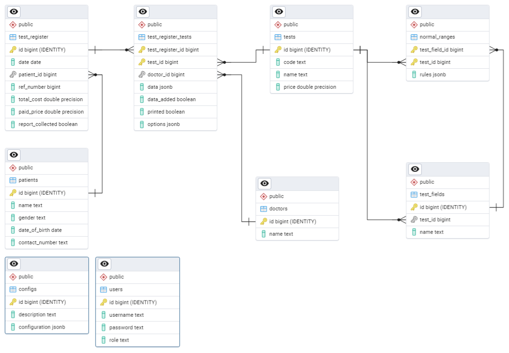

# LabSync - Desktop #
LabSync - Desktop is a standalone desktop application developed to handle essential tasks in a medical laboratory. This application includes functionality to save patient details, print reports and receipts, analyze data, and visualize it in charts to make it more user-friendly.

Using this application operators can replace heavy applications like Microsoft Word and can print reports with one click. And this application is cross-platform therefore can export to any operating system like Windows, MacOS, or Linux.

## Technologies and libraries ##
* Node.js
* PostgreSQL
* React
* Electron.js
* PDFkit
* Chart.js

## Setting up ##
1. First run `npm ci` command to install dependancies
2. Then install postgreSQL and create a database named ***labsync_desktop***
3. Import the database dump files in ***database-dump*** folder
4. Create a ***.env*** file in root directory including following information
```
DB_USER=
DB_HOST=
DB_NAME=labsync_desktop
DB_PW=
DB_PORT=
```
5. Depending on your operating system add files in ***AppData*** folder to the ***userData*** path.<br>
For an example on windows this path is `C:\Users\<user name>\AppData\Roaming\labsync-electron`
6. Run `npm run dev` to spin up development server
7. Use ***admin*** as the user name and ***1*** as the password
8. Run `npm run dist:win`, `npm run dist:linux`, `npm run dist:mac` to build executable files.

## Database ERD ##


